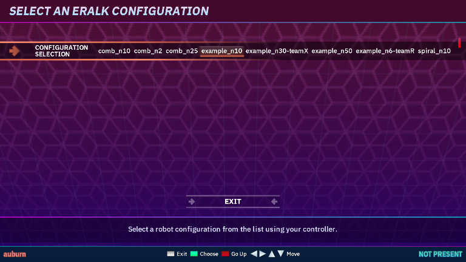
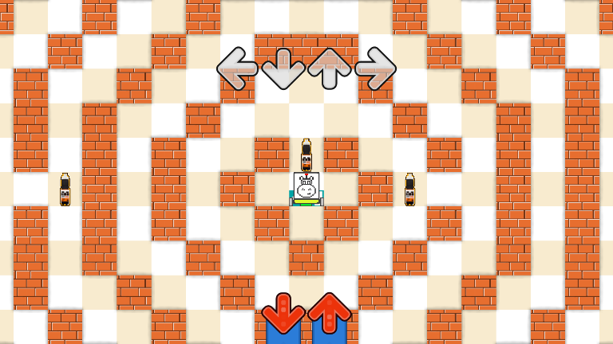
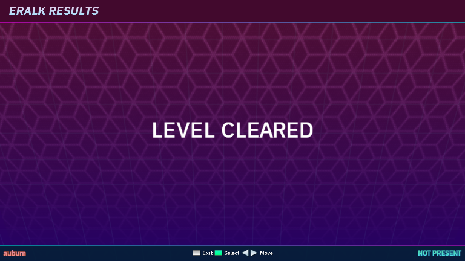
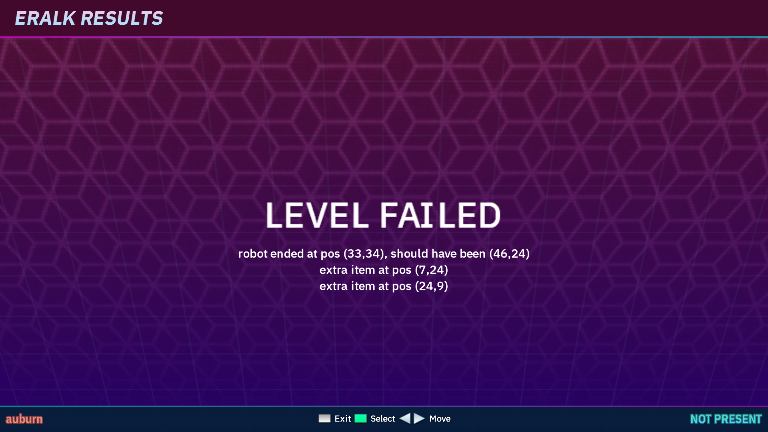
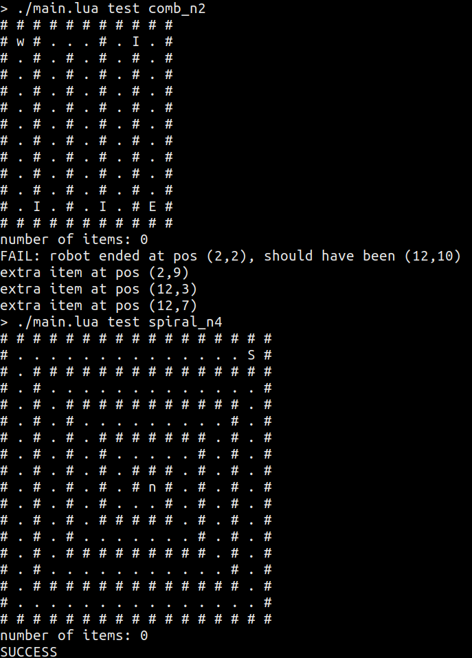

# Introduction

Welcome to the Dancing Robots project!
This is a game realized as a theme for Project OutFox, a Stepmania fork[^note].

The game is intended to be played in two stages.
In the first stage you program a robot using a simple programming language.
In the second stage you need to dance in order to successfully execute the instructions in your program!

## Using this documentation
You can use the arrows on your keyboard to move between subsequent pages (as dictated by the menu on the left of this page).
You may also quickly search for information by using the search icon on top of each page.

## Screenshots

||
|:--:|
|Selection screen|

 

|  |
|:--:|
| OutFox gameplay                             |

 

|  |
| :--:                                                            |
| Evaluation screen - success                                     |
 

|  |
| :--:                                                     |
| Evaluation screen - failure                              |
 

|  |
|                                   :--: |
|                 Command-line interface |

[^note] [.](https://kam.mff.cuni.cz/~auburn/misc/sm.png)
