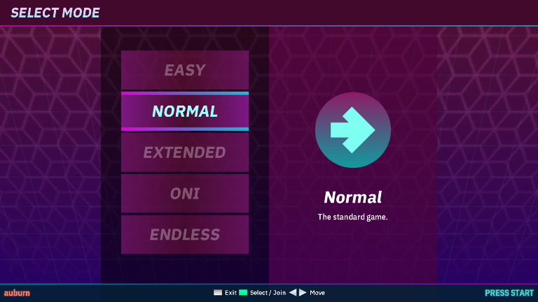
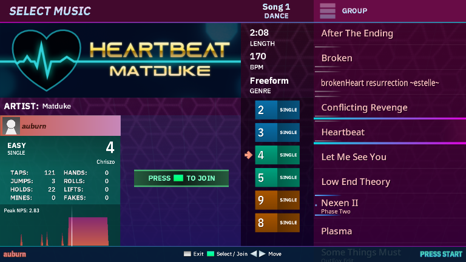
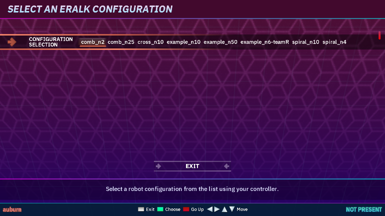
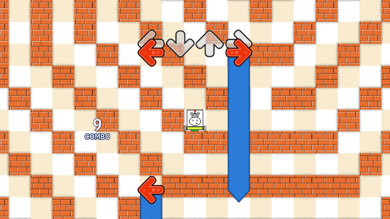

# How to dance

[Here](https://ddrcommunity.com/basic-patterns-that-you-need-to-know/)'s a link to familiarize yourself with the basic patterns in dance games.

Once you have your output files ready in the `Outputs` directory, you may choose to start Outfox.
Select the `dance` mode if prompted.
Upon selecting the difficulty, pick either `Easy` or `Normal`.

|  |
| :--:                                                     |
| Game difficulty selection menu                           |

You may choose to play either in a singleplayer or a multiplayer in any difficulty you'd like.
If you decide to do multiplayer, then determining whether or not a group of instructions should be executed correctly
depends on if *any* of the players succeeds in hitting any of the notes associated with the instruction group.

Select a song and choose a desired problem instance to solve.

|  |
| :--:                                                |
| Song selection screen                               |

 

|  |
| :--:                                                      |
| Problem selection screen                                  |

Keep playing as good as you can!
There are at least 3 notes associated with each instruction.
Hold and roll notes each count as two notes - one is for the note's head, the other for its tail.

|  |
| :--:                                          |
| Gameplay screen                               |

Aaaand here's the evaluation screen.
If you fail, you will see what exactly ended up being wrong with your run (from the judge's output).
The error list is limited to 3 errors only.

|  |
| :--:                                                                |
| Failed gameplay evaluation screen                                   |
