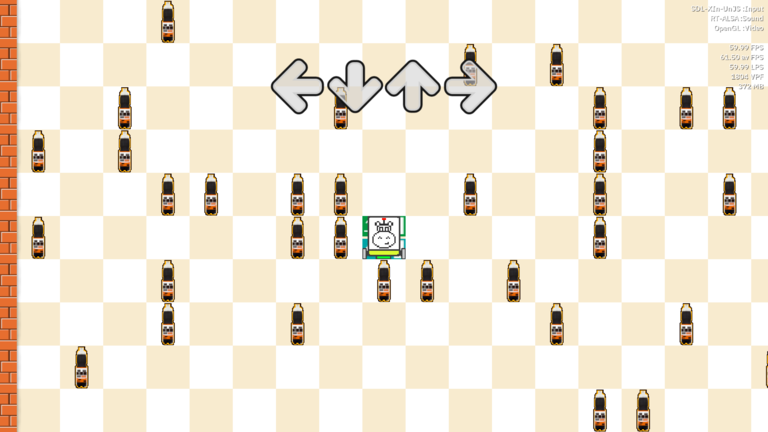

# Problemset

There's currently 5 classes of problems, each with a slightly different goal.

They all have a couple of things in common:
- input and output format
- accepted set of commands
- Eralk must be in the end cell after interpreting all instructions

## Problem classes
- [comb](comb)

|  |
| :--:                                         |
| comb gameplay                                |

- [matrix](matrix)

|  |
| :--:                                    |
| matrix gameplay                         |

- [sortp](sortp)

|  |
| :--:                                  |
| sortp gameplay                        |

- [spiral](spiral)

|  |
| :--:                                    |
| spiral gameplay                         |

- [wave](wave)

|  |
| :--:                                |
| wave gameplay                       |

