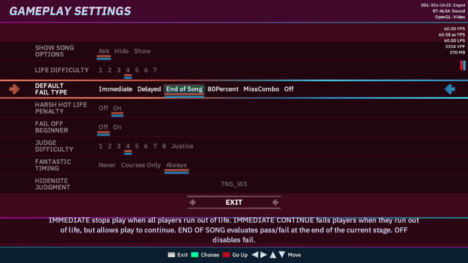

# Setup
The process of setting up this game involves three crucial steps:
1. cloning the Dancing Robots repository
1. downloading and installing the engine
2. adjusting a couple of preferences and linking the environment

## Cloning the repository
```sh
git clone git@gitea.ks.matfyz.cz:auburn/dancing-robots.git
```

## Installing the engine
This project is targeted at Project OutFox.
You may download it for your OS at the bottom of [this Project Outfox page](https://projectoutfox.com/releases/0.5.0-pre041).
There should be a binary/installer ready to get you quickly started with the game.

You can find detailed information on how to set the engine up at the [Project Outfox Wiki guide](https://outfox.wiki/user-guide/setup/install/).
The binary itself should be functioning on its own, but if you run into issues, you may find relevant troubleshooting tips there.


## Environment configuration
1. First off, run the engine binary. This should create a game directory somewhere in your `$HOME`.
Let's assume it's `~/.project-outfox`.
2. Fire up your favourite shell. Make sure the shell is in the root of the working tree of this repository.
```sh
mkdir -p ~/.project-outfox/Themes/
ln -sr eralk ~/.project-outfox/Themes/eralk
```
3. Now running the engine, adjust your preferences in its GUI:
  - you may also change these preferences in `~/.project-outfox/Save/Preferences.ini`
  - Resolution:
    - Options -> Display & Graphics -> Display and Resolution (set the correct resolution of your display here)
  - Select this theme:
    - Options -> User experience -> Appearance options -> Theme (select ERALK)
  - Fail at end:
    - Options -> System settings -> Gameplay settings -> Default fail type -> End of song

|  |
| :--:                                                 |
| Fail at end setting                              |

## File reloading
If you want for the engine to notice any new input/output files, return to the Main menu.
